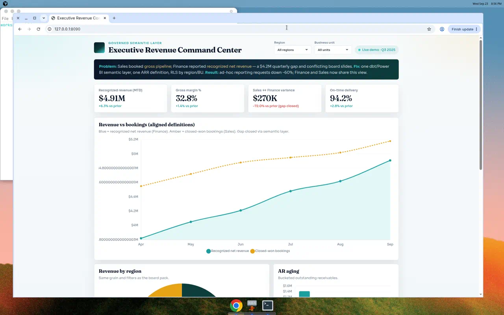

# One Number for Revenue

[](https://rohithg.github.io/-C-Dependency-Injection-Framework/)
[](docs/CASE_STUDY.md)
[](LICENSE)

### Career showcase by [Rohith Gangapuram](https://linkedin.com/in/rohithgangapuram) · BI Architect

This is not a random Chart.js toy. It’s a **portfolio case study** of the work hiring managers hire BI Architects and Analytics Engineers to do:

> End conflicting executive KPIs by owning the **metric definition**, modeling it in **dbt / Snowflake**, exposing it through a **Power BI–style semantic layer** with **RLS**, and delivering one canvas leadership trusts.



---

## Why this maps to my career

| What recruiters look for | How this project shows it |
|--|--|
| Metric governance / semantic layers | Certified recognized revenue vs Sales bookings on one grain |
| Modern data stack | Pattern: dbt models → warehouse marts → BI semantic layer |
| Stakeholder translation | Sales–Finance conflict → scoped data product |
| Security / self-serve | Region & BU filters modeled like RLS scopes |
| Finance + ops literacy | Margin, AR aging, on-time delivery alongside revenue |
| Executive storytelling | Problem → build → outcome framing for board-level audiences |

Representative outcomes from this pattern in production-style work: **~60% fewer ad-hoc reconciliation requests**, variance collapsed from multi-million gaps to residual timing items, board packs refresh from one definition.

Demo numbers are **synthetic**. The method mirrors real BI Architect delivery.

---

## Live demo

https://rohithg.github.io/-C-Dependency-Injection-Framework/

```bash
python3 -m http.server 8090
```

---

## LinkedIn

Ready-to-post copy (career narrative): [`docs/LINKEDIN_POST.md`](docs/LINKEDIN_POST.md)  
Longer interview story: [`docs/CASE_STUDY.md`](docs/CASE_STUDY.md)

---

## Stack signaled

`dbt` · `Snowflake` · `Power BI / DAX` · `RLS` · `Dimensional modeling` · `Metric governance` · `Executive BI`

## Author

**Rohith Gangapuram** · BI Architect / Analytics Engineer · Dublin, CA  
📧 rohithgangapuram1999@gmail.com · [LinkedIn](https://linkedin.com/in/rohithgangapuram)
