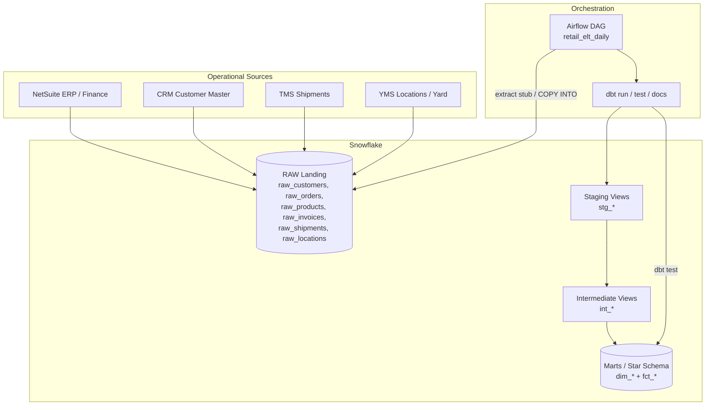
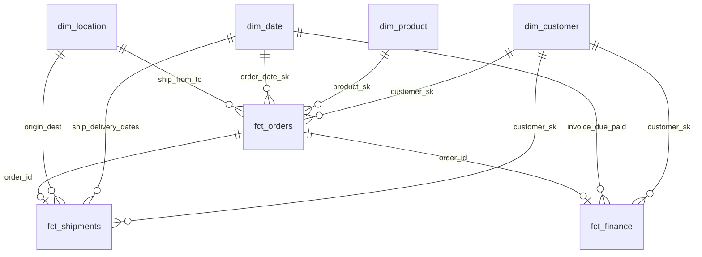

# Architecture — Snowflake Retail Data Warehouse

## Overview

This project implements an **ELT** pattern for retail and supply-chain analytics:

1. **Extract / Load** operational data from ERP (NetSuite), CRM, TMS, and YMS into Snowflake `RAW` tables.
2. **Transform** with **dbt** through staging → intermediate → marts (star schema).
3. **Orchestrate** the daily cycle with **Airflow**.

## ELT flow

## Layering

| Layer | Schema | Materialization | Responsibility |
|-------|--------|-----------------|----------------|
| Raw | `raw` | Tables (load / seed) | Immutable landing; 1:1 with source extracts |
| Staging | `staging` | Views | Rename, type cast, dedupe, light enrichment |
| Intermediate | `intermediate` | Views | Business joins, margin / dwell / AR logic |
| Marts | `marts` | Tables | Conformed dimensions + facts for BI |

## Star schema

### Fact grains

- **fct_orders** — one row per sales order line
- **fct_shipments** — one row per TMS shipment (with YMS dwell)
- **fct_finance** — one row per AR invoice

### Dimensions

- **dim_customer**, **dim_product**, **dim_location** — conformed entities
- **dim_date** — calendar + fiscal attributes (fiscal year starts in February)

## Data quality

dbt tests (unique, not_null, relationships, accepted_values) gate every DAG run after `dbt run`. Failed tests fail the Airflow task and block docs refresh.

## Local vs Snowflake

| Mode | Profile target | Notes |
|------|----------------|-------|
| Production | `snowflake` | Use `sql/ddl/raw_landing_tables.sql`, real extract, Airflow |
| Local demo | `duckdb` | `dbt seed && dbt run --target duckdb` (see README) |

Models intentionally avoid Snowflake-only syntax where practical so the same project can smoke-test on DuckDB.
