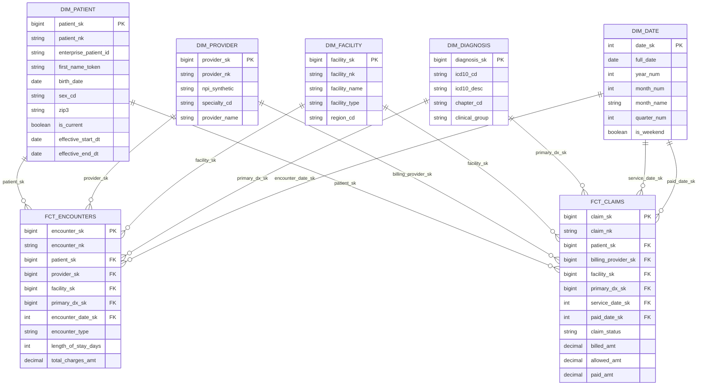
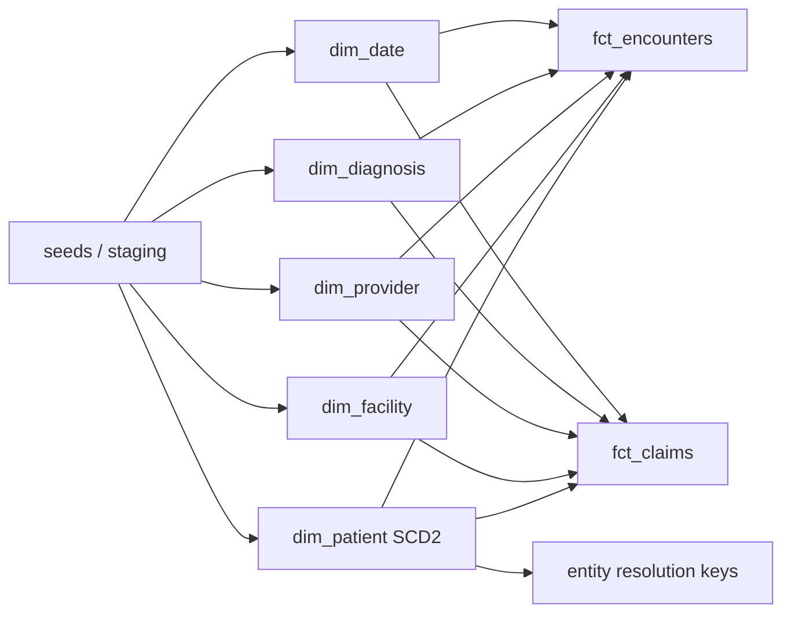

# Architecture — Healthcare Star Schema

**Synthetic demo model only.** No real PHI.

This document describes the dimensional model used to support encounter and claims analytics for a fictional integrated delivery network (IDN). The design mirrors patterns used in EHR + claims warehouses: conformed dimensions, additive facts, and SCD Type 2 history on mutable patient attributes.

---

## Star schema (Mermaid)

---

## Grain definitions

| Table | Grain | Notes |
|---|---|---|
| `dim_patient` | One row per patient version (SCD2) | `is_current = TRUE` marks the active version |
| `dim_provider` | One row per provider (Type 1) | Synthetic NPI; specialty as attribute |
| `dim_facility` | One row per facility (Type 1) | Site of care / care delivery location |
| `dim_diagnosis` | One row per ICD-10 code | Conformed across encounters & claims |
| `dim_date` | One row per calendar day | Shared conformed date dimension |
| `fct_encounters` | One row per clinical encounter | Primary diagnosis only at grain; secondary dx via bridge (out of scope) |
| `fct_claims` | One row per claim header | Line-level claim detail out of scope for this demo |

---

## Conformed dimensions

`dim_patient`, `dim_provider`, `dim_facility`, `dim_diagnosis`, and `dim_date` are **conformed**: the same surrogate keys are used by both `fct_encounters` and `fct_claims`. This enables cross-domain questions such as:

- Encounter volume vs. claim paid amount by diagnosis chapter
- Provider panel size (encounters) vs. revenue (claims)
- Facility utilization and cost trends on a shared calendar

---

## Load order

1. Load / generate `dim_date`
2. Load reference dims: diagnosis, provider, facility
3. Resolve enterprise patient keys → load `dim_patient` (SCD2)
4. Load facts with surrogate key lookups

---

## Source systems (synthetic)

| Source alias | Feeds | Notes |
|---|---|---|
| `EHR_ENC` | encounters, diagnosis on visit | Clinical visit events |
| `RCM_CLM` | claims headers | Revenue cycle / billing |
| `MPI_SRC_A` / `MPI_SRC_B` | patient identity fragments | Used in entity-resolution demo |

All source extracts in `seeds/` are labeled **SYNTHETIC**.

---

## Metrics supported (examples)

- Encounter count by type, facility, specialty, diagnosis chapter
- Average length of stay (inpatient)
- Claim paid / allowed / billed amounts by service month
- Denial or rejection rate (`claim_status`)
- Patient panel continuity (SCD2 history of attributed PCP / ZIP3)

---

## Related docs

- [`hipaa-design-notes.md`](hipaa-design-notes.md) — tokenization & least privilege
- [`../entity-resolution/README.md`](../entity-resolution/README.md) — MPI matching approach
- [`../data-quality/README.md`](../data-quality/README.md) — DQ checklist
