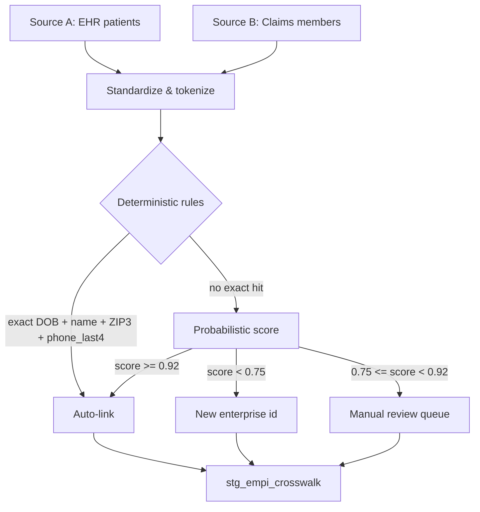

# Entity Resolution — Cross-System Patient Matching

**Synthetic demo only. No real PHI.**

Healthcare warehouses rarely receive a single clean patient key. EHR MRNs, claims member IDs, and registration systems often refer to the same person with different identifiers and slightly different demographics. This folder documents a practical **deterministic + probabilistic** matching approach suitable for analytics engineering portfolios (not a clinical MPI product).

---

## Objectives

1. Produce a durable **`enterprise_patient_id`** (EMPI-style surrogate).
2. Maintain a **crosswalk** from each source system id → enterprise id.
3. Prefer **high-precision deterministic** matches; escalate ambiguous pairs for review.
4. Never auto-merge on weak scores when clinical or financial decisions depend on identity.

---

## Matching strategy

### Deterministic rules (high confidence)

| Rule | Fields | Action |
|---|---|---|
| R1 | DOB + normalized last + first + ZIP3 + phone_last4 | Auto-link |
| R2 | DOB + normalized last + first + ZIP3 (no phone) | Auto-link if unique candidate |
| R3 | Same source_patient_id already in crosswalk | Identity pass-through |

### Probabilistic features (illustrative weights)

| Feature | Weight |
|---|---|
| Exact DOB match | 0.35 |
| Last name Jaro-Winkler ≥ 0.95 | 0.25 |
| First name Jaro-Winkler ≥ 0.90 | 0.15 |
| ZIP3 match | 0.15 |
| phone_last4 match | 0.10 |

Score = sum of matched feature weights. Thresholds above are demo defaults.

---

## Outputs

| Table / artifact | Purpose |
|---|---|
| `stg_empi_resolved` | One row per enterprise patient with preferred demographics |
| `stg_empi_crosswalk` | source_system_cd + source_patient_id → enterprise_patient_id |
| `stg_empi_review_queue` | Ambiguous pairs for human review |

SQL implementation: [`match_patients.sql`](match_patients.sql)

---

## Governance notes

- Matching runs in a restricted schema; analysts consume only enterprise keys.
- False merges are worse than false splits for clinical attribution — bias toward review.
- All examples use synthetic names (`Alex`, `Jordan`, …) and synthetic IDs (`SYN-EHR-…`, `SYN-CLM-…`).

See also: [`../docs/hipaa-design-notes.md`](../docs/hipaa-design-notes.md)
