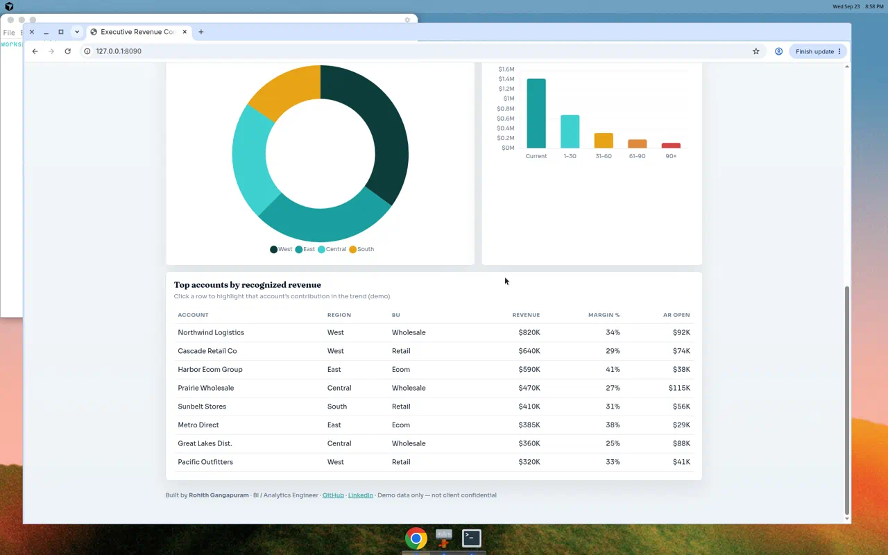

# Executive Revenue Command Center

[](https://rohithg.github.io/linkedin-executive-dashboard/)
[](docs/LINKEDIN_POST.md)
[](LICENSE)

### ★ Standout project for LinkedIn & portfolio pin

Interactive **executive BI dashboard** by [Rohith Gangapuram](https://github.com/rohithg) — the artifact you screenshot, post, and pin.

It shows how a **governed semantic layer** ends the Sales-vs-Finance revenue fight: one definition, one canvas, filters leadership actually use.


---

## 60-second story

| | |
|--|--|
| **Problem** | Sales booked *gross closed-won*; Finance reported *recognized net* — **~$4.2M** quarterly gap, conflicting board slides |
| **Fix** | One dbt / Power BI semantic layer + RLS by region/BU + this command-center UX |
| **Result** | Variance collapsed; ad-hoc “whose number is right?” requests down ~**60%** |

Demo data is **synthetic**. The method mirrors production BI work.

---

## Try it

```bash
python3 -m http.server 8090
# → http://localhost:8090
```

**Live (after Pages):** https://rohithg.github.io/linkedin-executive-dashboard/



---

## What’s interactive

- KPI strip: recognized revenue, margin %, Sales↔Finance variance, on-time delivery  
- Dual-series trend: **Finance recognized** vs **Sales bookings**  
- Region donut + AR aging  
- Account table with click-to-focus  
- Region & business-unit filters that rescale the demo  

---

## Post this on LinkedIn

1. Open the live demo (or local server)  
2. Screenshot the **banner + KPI row + trend chart** (hero shot above)  
3. Paste [`docs/LINKEDIN_POST.md`](docs/LINKEDIN_POST.md)  
4. Pin this repo on GitHub · add the live link under LinkedIn **Featured**

Full narrative: [`docs/CASE_STUDY.md`](docs/CASE_STUDY.md)

---

## Skills this proves

`Power BI / semantic layers` · `Executive storytelling` · `Metric governance` · `RLS concepts` · `Finance literacy (AR, margin)` · `Analytics UX`

---

## Stack

Static HTML / CSS / JS · [Chart.js](https://www.chartjs.org/) · Fraunces + Sora  
No backend · No secrets · MIT licensed · Safe to share publicly

---

## Author

**Rohith Gangapuram** · Business Intelligence / Analytics Engineer · Dublin, CA  
📧 rohithgangapuram1999@gmail.com · [LinkedIn](https://linkedin.com/in/rohithgangapuram) · [Portfolio](https://rohithg.github.io/rohith-portfolio/)
